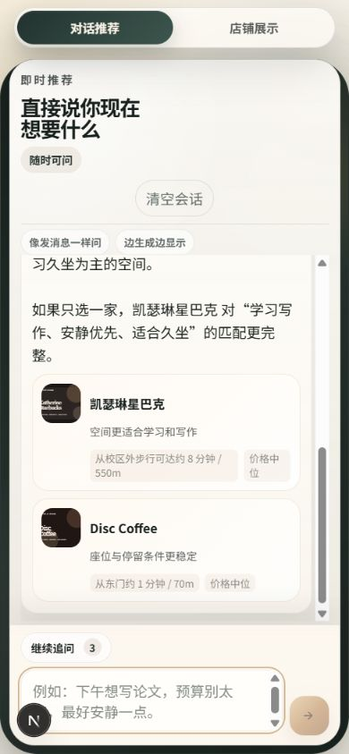
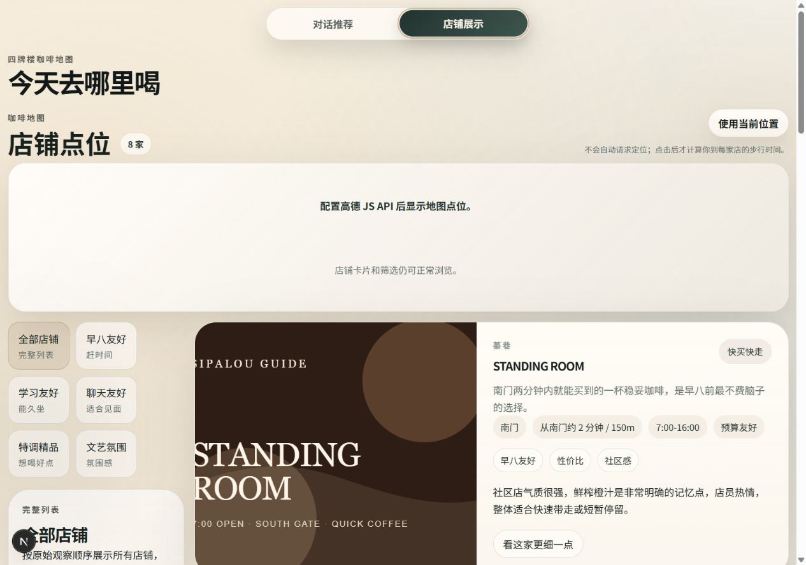
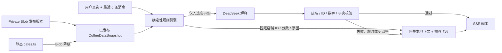

# 四牌楼咖啡决策 Agent

[](https://github.com/t2860270510-maker/sipailou-coffee-guide/actions/workflows/ci.yml)
[](https://sipailou-coffee-guide.vercel.app)

面向东南大学四牌楼校区周边的咖啡决策工具。它先用本地结构化规则稳定选出最多两家，再由 DeepSeek 解释“为什么选、各有什么取舍”。模型不可用、超时、空回答或输出越界时，页面仍会收到同一组店铺的完整本地推荐。





## 核心保证

- 每次最多推荐两家；有硬条件且不足两家时不拿不合格店铺凑数。
- 正文和卡片共用规则引擎产生的店铺 ID。
- 支持最近 6 条真实消息，让“预算再低一点”“换成更适合久坐的”继承上一轮。
- DeepSeek 只能解释已选中的店，不能看见或改选其他店。
- SSE 协议固定为 `meta → phase → recommendations → sources → phase → token* → error? → done`。
- CoffeeOverlay v1 让线上店铺数据可保存草稿、严格校验、发布、历史回退；公开问答只读取已发布版本。
- Private Blob 缺失、损坏或版本不兼容时自动使用 `lib/cafes.ts` 静态基线。
- 页面不会自动请求定位；地图不可用时，店铺列表仍可完成导航、复制地址、分享和问题反馈。

## 架构



主要模块：

- `lib/recommendation.ts`：纯函数规则、历史意图合并、硬排除、Top2 和本地正文。
- `lib/deepseek.ts`：OpenAI 兼容接口、12 秒流超时、6 秒非流式补救和事实校验。
- `lib/sse.ts`：支持任意网络分片、UTF-8 跨分片、CRLF/LF、多行 data、BOM 和 EOF 尾事件。
- `lib/data/`：CoffeeOverlay schema、Private Blob 适配、60 秒公开快照、发布和回退事务。
- `app/admin`：单口令管理台；草稿试聊不会影响公开数据。
- `app/api/health`：无敏感信息的运行状态。

## 本地运行

需要 Node.js 24。

```bash
npm ci
cp .env.example .env.local
npm run dev
```

常用检查：

```bash
npm run lint
npm run typecheck
npm test
npm run build
npm run test:e2e
```

## 环境变量

| 变量 | 范围 | 必需 | 说明 |
| --- | --- | --- | --- |
| `DEEPSEEK_API_KEY` | 服务端 | 否 | 未配置时始终使用完整本地推荐 |
| `DEEPSEEK_BASE_URL` | 服务端 | 否 | 默认 `https://api.deepseek.com` |
| `DEEPSEEK_MODEL` | 服务端 | 否 | 默认 `deepseek-v4-flash` |
| `AMAP_WEB_KEY` | 服务端 | 否 | 批量步行距离；缺失时使用校门距离 |
| `NEXT_PUBLIC_AMAP_JS_KEY` | 浏览器 | 否 | 高德地图 JS API，必须配置域名白名单 |
| `NEXT_PUBLIC_AMAP_SECURITY_JS_CODE` | 浏览器 | 否 | 高德 JS API 安全密钥 |
| `COFFEE_DATA_BLOB_READ_WRITE_TOKEN` | 服务端 | Phase 2 必需 | 独立 Private Blob：草稿与发布版本 |
| `COFFEE_DATA_BLOB_STORE_ID` | 服务端 | Vercel 推荐 | Private Blob Store ID；使用 Vercel OIDC 时可替代数据 Blob Token |
| `COFFEE_MEDIA_BLOB_READ_WRITE_TOKEN` | 服务端 | 上传图片必需 | 独立 Public Blob：清理元数据后的 WebP |
| `COFFEE_MEDIA_BLOB_STORE_ID` | 服务端 | Vercel 推荐 | Public Blob Store ID；使用 Vercel OIDC 时可替代媒体 Blob Token |
| `ADMIN_ACCESS_TOKEN` | 服务端 | 管理台必需 | 单一管理口令，同时作为签名密钥；轮换会使旧 Cookie 失效 |
| `APP_ORIGIN` | 服务端 | 生产建议 | 管理写接口允许的站点 Origin |

数据与媒体 Blob 必须使用两个独立 Store；在 Vercel 上优先配置 Store ID 并使用平台 OIDC，其他运行环境可以配置各自的读写 Token。不要把任何服务端 Key 写入 `NEXT_PUBLIC_*`。高德前端 Key 本来就会公开，必须在高德开放平台只允许生产域名和 Vercel Preview 所需域名。

## 数据维护、发布与回退

1. 打开 `/admin`，输入管理口令和核验人姓名。
2. 修改结构化字段、营业时间、坐标、图片和来源。每项事实变更需要对应 `fieldEvidence`。
3. 保存草稿。草稿不会影响公开页面。
4. 用“草稿试聊”验证规则和文案；未保存的浏览器草稿也只用于这次试聊。
5. 查看发布差异并运行严格校验。
6. 发布时先写入不可变 `coffee-data/releases/<timestamp>-<uuid>.json`，再用 ETag 更新 `coffee-data/published.json`。
7. 回退会复制目标内容生成一条新的 rollback release，不会覆盖历史文件，并把目标内容同步成当前草稿。

Blob 布局：

```text
coffee-data/draft.json
coffee-data/published.json
coffee-data/releases/<timestamp>-<uuid>.json
coffee-media/<cafeId>/<timestamp>-<uuid>.webp
```

静态店恢复基线就是删除对应 patch。未发布新增店可删除；只要出现在任一发布版本中，就只能改为 `inactive`、`temporarily_closed` 或 `permanently_closed`。

## 部署检查清单（Vercel）

- Production 与 Preview 都使用 Node 24。
- Production/Preview 分别连接独立的数据 Private Blob、媒体 Public Blob 和 `ADMIN_ACCESS_TOKEN`。
- Preview 同样配置 `AMAP_WEB_KEY`；高德前端 Key 设置正确域名白名单。
- Vercel Firewall 为 `/api/recommend` 配置每 IP 20 次/60 秒固定窗口；应用内还限制每 IP 同时 2 个、单实例模型请求同时 12 个。
- `GET /api/health` 显示正确的数据版本、有效店铺数和降级状态。
- GitHub Actions 的 Linux、Windows、macOS 与 Chromium 任务全部通过。
- Preview 验证后再提升到 Production；生产发布后运行本地降级推荐和 13 条验收场景。

项目只维护 Vercel 部署链路；旧 Netlify、Cloudflare/OpenNext/Wrangler 配置已移除。

## 故障排查

- 正文或模型异常：查看 `/api/health` 的模型配置；无论原因如何，公开推荐都应显示本地完整正文和一致卡片。
- Blob 故障：健康接口会显示 `source: static`、`degraded: true` 和兼容警告；修复 Blob 后最多 60 秒恢复。
- 发布冲突：刷新管理台，重新核对差异后发布；系统不会覆盖其他管理员的新版本。
- 地图空白：确认高德 JS Key、Security Code、域名白名单和 CSP；列表功能不依赖地图。
- 距离失败：确认服务端 `AMAP_WEB_KEY`。定位失败只影响排序信号，不影响店铺浏览。
- 管理会话失效：重新登录；口令轮换会主动使旧签名 Cookie 无效。

结构化日志只记录耗时、模型结果、降级原因、接口错误和定位成功率，不记录查询正文、IP 或坐标。

## 许可

- 代码：MIT，见 [LICENSE](LICENSE)。
- 原创文字与原创图片：CC BY-NC 4.0，见 [CONTENT_LICENSE.md](CONTENT_LICENSE.md)。
- 第三方媒体按各自来源和权利说明使用，不因本仓库许可而重新授权。
